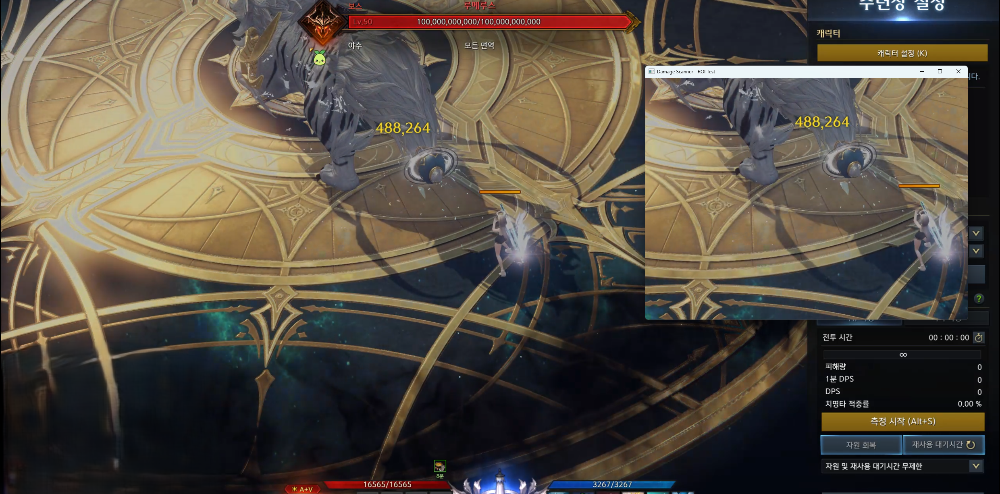
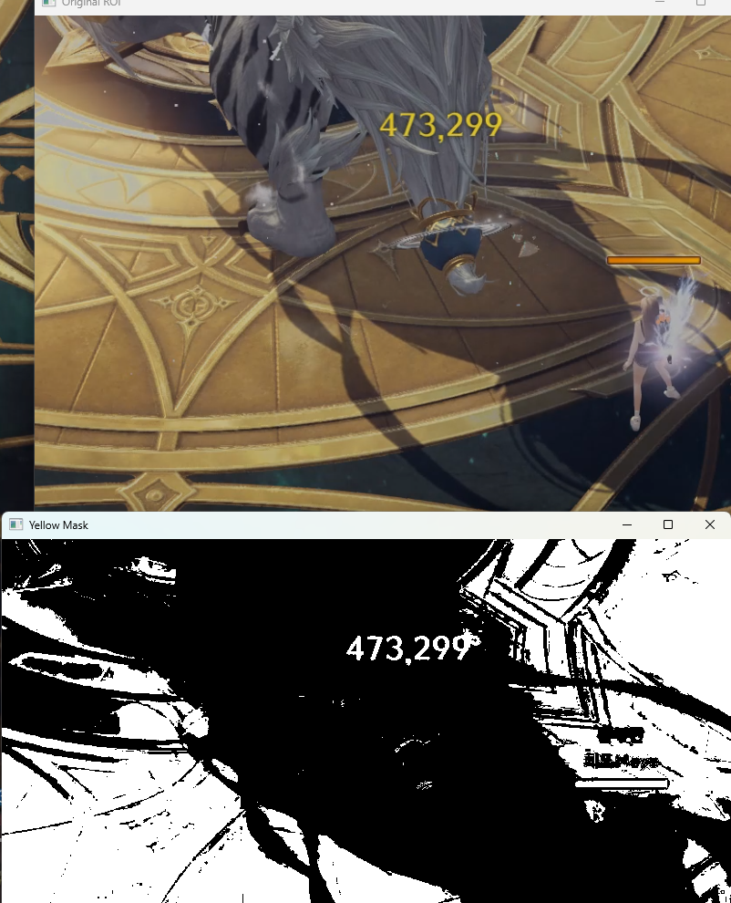
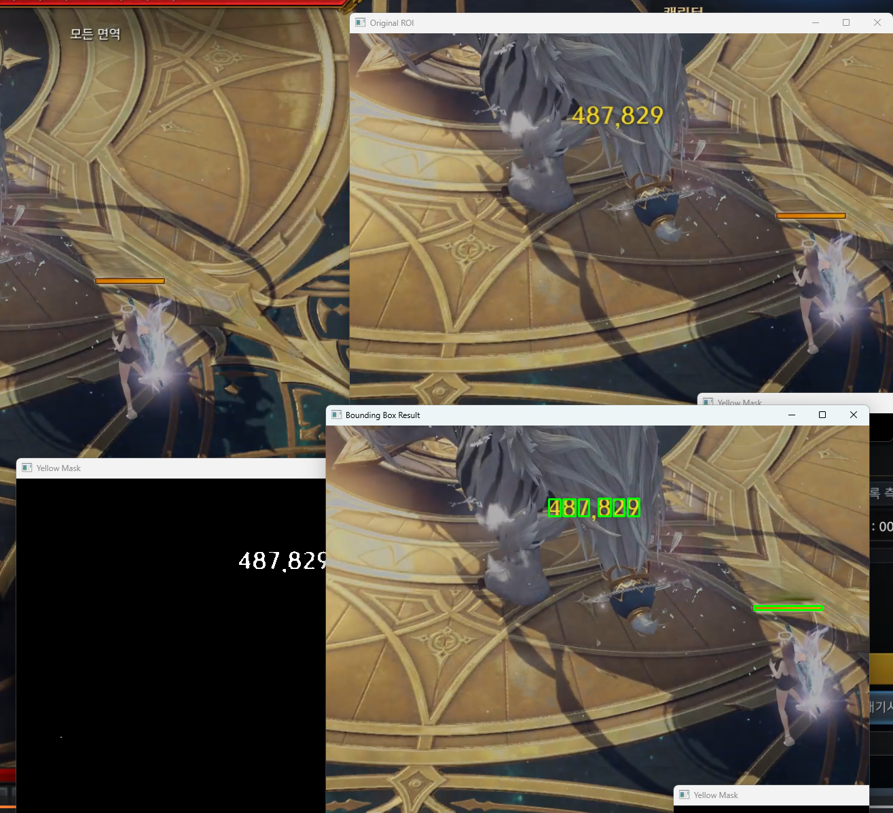
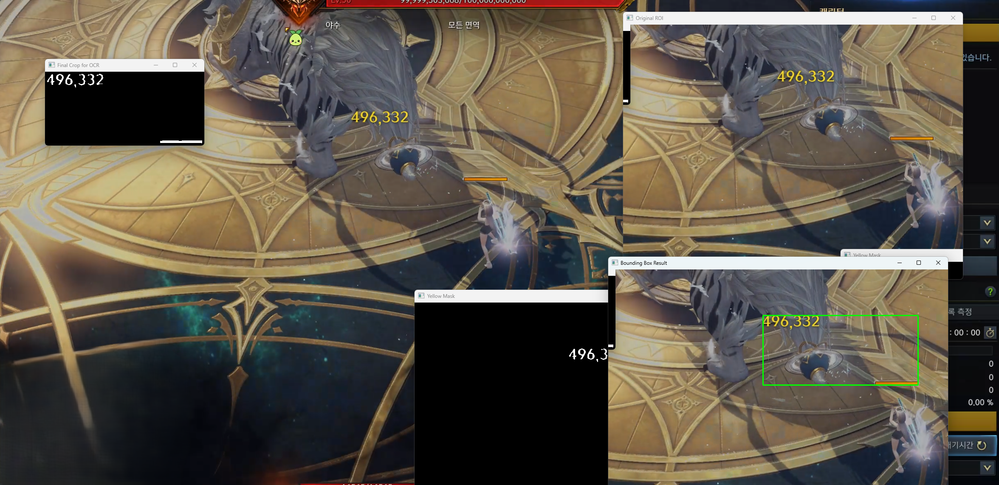
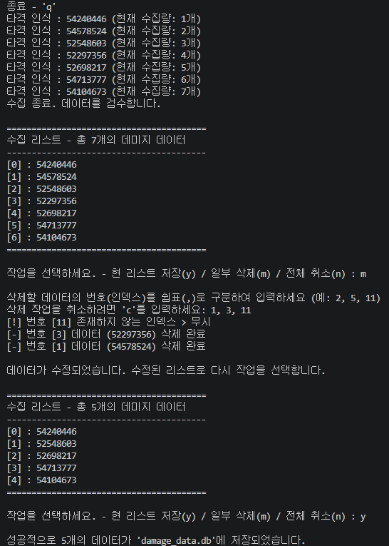

# LostArk-Damage-Scanner

## 1. 프로젝트 소개 (Introduce)
본 프로젝트는 OpenCV와 OCR을 활용하여, 이펙트와 노이즈가 심한 게임 화면 속에서 특정 데미지 숫자 폰트만을 실시간으로 스캔하고 추출하는 시스템입니다.   

학습한 컴퓨터 비전의 다양한 이미지 전처리 기법을 유기적으로 결합하여 인식률을 개선하였으며, 수집된 데이터는 결측치 검수 로직을 거쳐 SQLite를 통해 데이터베이스에 자동 적재됩니다.   

#### Data Analysis Extension
본 프로젝트는 [데이터 수집 ➔ DB 적재 ➔ 데이터 분석]으로 이어지는 파이프라인의 데이터 수집 및 적재 파트를 담당합니다. 여기서 직접 수집하고 정제하여 생성한 SQLite 데이터를 바탕으로 수행한 다중 선형 회귀 분석 및 시각화 프로젝트의 기초 자료로 활용됩니다.   
관련 프로젝트는 아래 링크에서 확인하실 수 있습니다.   
https://github.com/Riosen03/Damage-coefficient-estimation

## 2. 주요 기능 및 특징 (Features)

### 실시간 관심 영역(ROI) 캡처
전체 화면이 아닌 데미지 발생 영역만 mss 라이브러리로 타겟팅하여 연산량을 최소화하고 실시간 처리 속도를 확보   

  

### 컴퓨터 비전 기반 이진화 및 노이즈 제거(전처리)
HSV 색상 공간 마스킹, Morphology 연산, 윤곽선(Contour) 검출을 조합하여 화려한 스킬 이펙트 속에서도 폰트 영역만 고립시켜 추출

### OCR 및 오인식 극복
게임 내 다단 히트 및 데미지 페이드아웃 애니메이션으로 인한 OCR 오인식으로 인한 잘못된 값과 중복 값의 저장을 막기 위해, 0.1초 단위의 버퍼(Buffer)와 최빈값(Mode)을 활용한 안정화 로직을 구현   
~~연산량의 감소를 위하여 템플릿 방식을 고려하였으나 위와 같이 데미지 폰트의 페이드아웃에 의한 크기문제와 자잘한 폰트 인식 문제로 인하여 성능 향상을 위한 멀티 스케일 매칭 및 다중 템플릿(Ensemble) 방식 도입을 사용 시 오히려 연산량이 증가할 것이라고 판단, rollback~~

### 수동 검수
간혹 발생하는 OCR이 잘못 읽은 쓰레기 값(Garbage Data)이 DB에 들어가는 것을 원천 차단하기 위해, 적재 전 수집 리스트를 출력하고 오인식된 데이터를 역순 인덱스로 안전하게 삭제할 수 있도록 수동 검수 기능 추가

## 3. 이미지 전처리 파이프라인 상세 (Core Algorithm)
OCR 엔진(EasyOCR)에 이미지를 전달하기 전, 인식률을 가능한 한 100%에 가깝게 끌어올리기 위해 아래와 같은 전처리 파이프라인을 거칩니다.

### Color Masking (이진화)
- 화면의 밝기 변화에 대응하기 위해 BGR 이미지를 HSV 색상 공간으로 변환합니다.
- 크리티컬 데미지 폰트의 고유 색상인 '노란색'의 특정 임계값(lower=[15, 150, 150], upper=[35, 255, 255])을 설정하여 마스크를 씌웁니다. 이를 통해 배경과 이펙트 노이즈를 1차로 완전히 제거합니다.   

  
  
  

### Morphology Operation (형태학적 연산)
- 임계값으로 인해 글자 테두리가 자글자글해지거나 깎여나가는 현상을 복원하기 위해 닫힘(Closing) 연산을 적용합니다.
- 3x3 커널을 이용해 글자를 팽창시켰다가 침식시켜, 끊어진 틈새를 메우고 폰트의 형태를 또렷하게 복원합니다.

### Bounding Box & Crop (객체 탐지 및 분리)
- cv2.findContours를 통해 마스킹된 흰색 덩어리들의 외곽선을 찾습니다.
- 면적이 50픽셀 이하인 자잘한 노이즈는 무시하고, 유효한 숫자 덩어리들을 감싸는 통합 Bounding Box를 계산하여 해당 영역의 흑백 마스크만 정교하게 잘라냅니다(Crop).

  
  

## 4. 데이터베이스 스키마 설계 (SQLite)

| 컬럼명 (Column) | 데이터 타입 (Type) | 설명 및 목적 |
| --- | --- | --- |
| `id` | INTEGER (PK) | 타격 데이터 고유 번호 (Auto Increment) 
| `intelligence` | INTEGER | 타격 당시의 지능 수치 (입력값) 
| `specialty` | INTEGER | 타격 당시의 특화 수치 (입력값) 
| `weapon_atk` | INTEGER | 타격 당시의 무기 공격력 수치 (입력값) 
| `total_atk` | INTEGER | 타격 당시의 총 공격력 수치 (입력값) 
| `damage_value` | INTEGER | 최종 확정된 데미지 수치 (OCR 인식 후 정제된 종속변수) 

## 5. Demo

### 5-1. 실시간 관심 영역(ROI) 캡처 및 OCR 인식 데모

### 5-2. 콘솔 기반 수동 검수 및 DB 적재 화면

## 6. 사용 라이브러리 및 실행 방법

### 사용 라이브러리   
cv2 - openCV   
numpy   
mss - 화면 캡처   
easyocr - OCR 엔진(en)   
re - 정규표현식(문자열 필터링)   
time - 시간 측정    
collections - 최빈값 계산    
sqlite3 - DB(SQLite)    

### 실행 방법
1. 필요 라이브러리 설치 (pip install opencv-python numpy mss easyocr)
2. main.py 실행 (python main.py)
3. 콘솔의 안내에 따라 현재 캐릭터의 스탯(지능, 무기 공격력, 총 공격력, 특화)을 차례대로 입력
4. 게임 내에서 타격을 진행(데미지 실시간 버퍼 수집)
5. 캡처 창을 선택하고 q 키를 누르면 수집 종료, 검수 모드로 진입
6. 콘솔에 출력된 수집 리스트를 확인하고, 이상치가 있다면 m을 눌러 해당 인덱스 번호를 쉼표로 구분해 삭제
7. 최종 확인 후 y를 눌러 damage_data.db 파일에 적재를 완료, 필요 시 n을 눌러 전체 취소